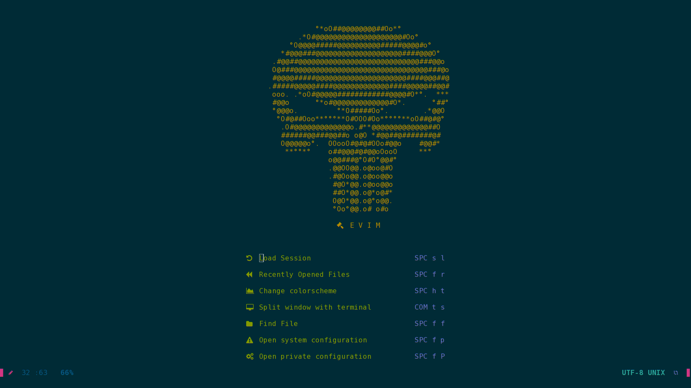

# Welcome to doom-evim
This project has been inspired by doom-emacs and doom-nvim. However, I named it doom because it is batteries-included like doom-nvim and doom-emacs. Why the 'e'? To pay a homage to emacs' revered emacs-lisp.

I also provide a big thanks to doom-nvim because I have stolen some of their stuff to configure mine. You can visit it here: [doom-nvim](https://github.com/NTBBloodbath/doom-nvim)

## Introduction
If you have used doom-emacs or doom-nvim before, you will be acquianted with what a 'distribution' means. This contains OPINIONATED configuration of my own that works out of the box. 

It is certainly not entirely complete but since doom is a distro, it comes with sane defaults that can aid in quickly bolting on required configurations.

## Features
1. Fennel support for those who really miss elisp!
2. Preconfigured Debugger Adapter Protocol (DAP) and Language Server Protocol (LSP) via vimspector and nvim-lsp.
3. Minimal abstraction provided by doom which facilitates easy configuration.
4. Default keybindings which similar to doom-emacs. 
5. Wide array of utility functions available to the user for complex configuration: `after!`, `specs!`, `add-hook`, `define-keys`, etc 
6. Which-key and snippets work out of the box. 
7. Comprehensive inbuild documentation accessible via `:help`.

## Installation

### Downloading the release
Please avoid cloning the repo and use the releases instead.
Unzip the file downloaded and copy it as ~/.config/nvim and follow the steps given below.

### Basic requirements
1. [neovim >= 0.5](https://github.com/neovim/neovim/wiki/Installing-Neovim). Please use any gui client for a better experience.
2. `fdfind`, `lua5.1`, `luarocks`, `rg`, `ruby`, `node` and `npm`. You OS package manager should have these. After you install these, please install `yarn` via `npm`.
3. lua5.1 modules: [rex_pcre2](https://rrthomas.github.io/lrexlib/manual.html), [luafun](https://luafun.github.io/), [lualogging](https://neopallium.github.io/lualogging/index.html), [lpath](https://github.com/starwing/lpath) and [lua-set](https://github.com/EvandroLG/set-lua). With ruby you can run `doom.rb` to install these.
4. GNU/Linux. Currently doom-evim only supports GNU/Linux.

### How to install other requirements?
Assuming that you have all of the above tasks done, you can use `doom.rb` to provide a basic utility script to do other tasks that may confuse the user. Please visit here: [doom.rb](./doomrb.md)

## How to update?
Just run `git pull` in `~/.config/nvim`.

## Screenshots
[Screenshots](./screenshots/README.md)

## Further reading
`:help doom-evim`

## Future plans
1. Add support to a variety of languages
2. ~~Get nvim-dap up and working.~~ Vimspector works for the languages it provides adapters for.

## Maintaining
I plan to make this a nice stable distribution. However, I need help maintaining this. Any volunteers are welcome here anytime!

