### This is how doom looks

---

### Which-key popup
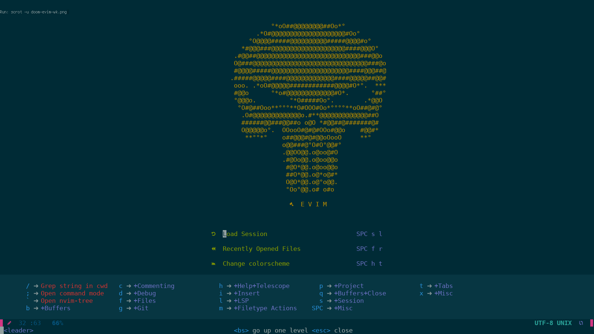

---

### LSP: Using trouble instead of virtual text
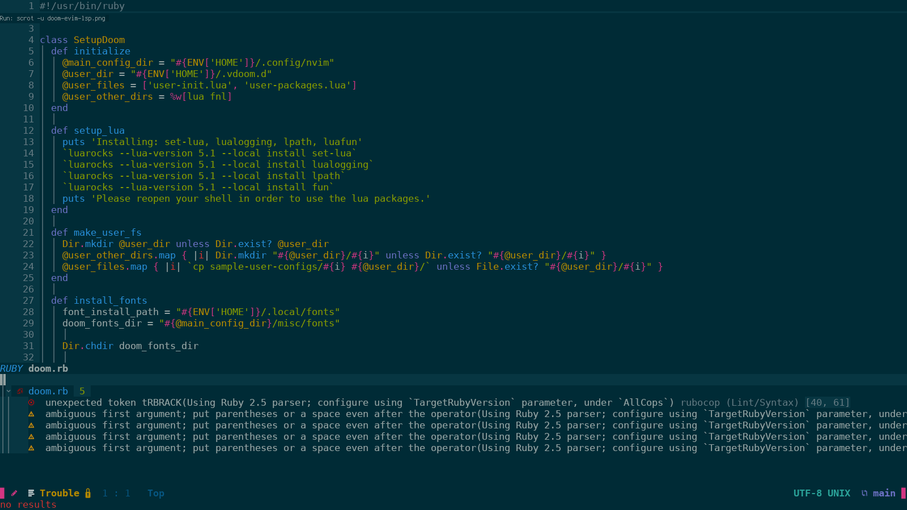

---

### Nvim-tree

---

### Runners: Async runner
#### Building
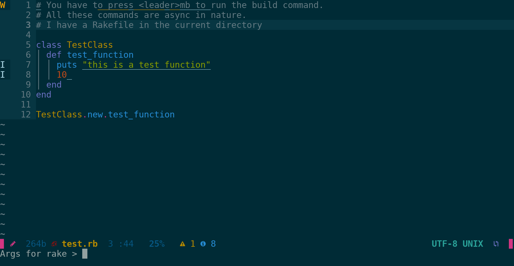
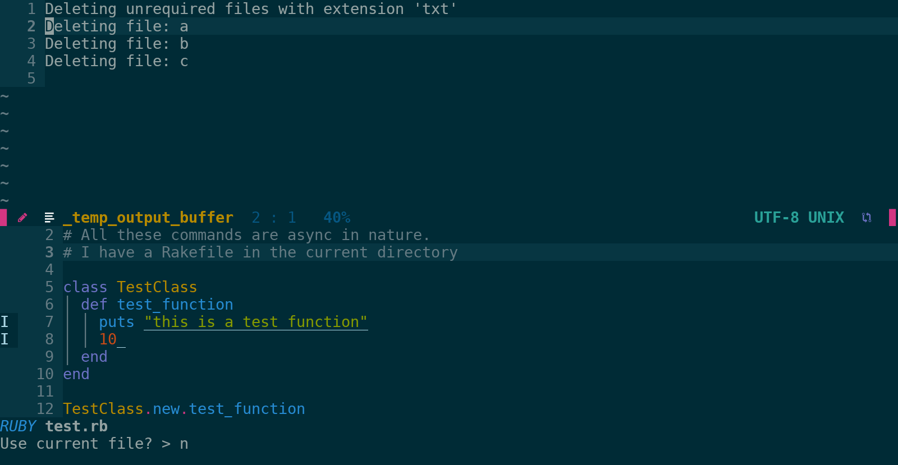

#### Compiling
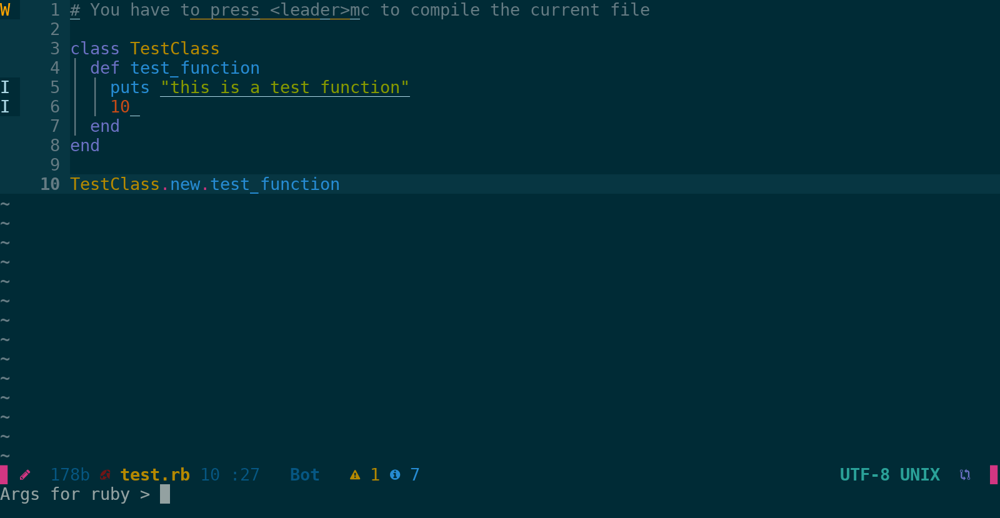
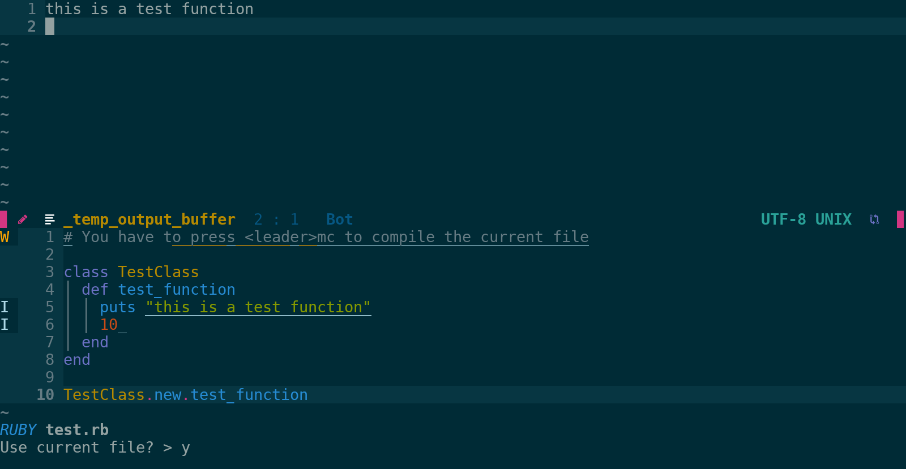

#### Testing
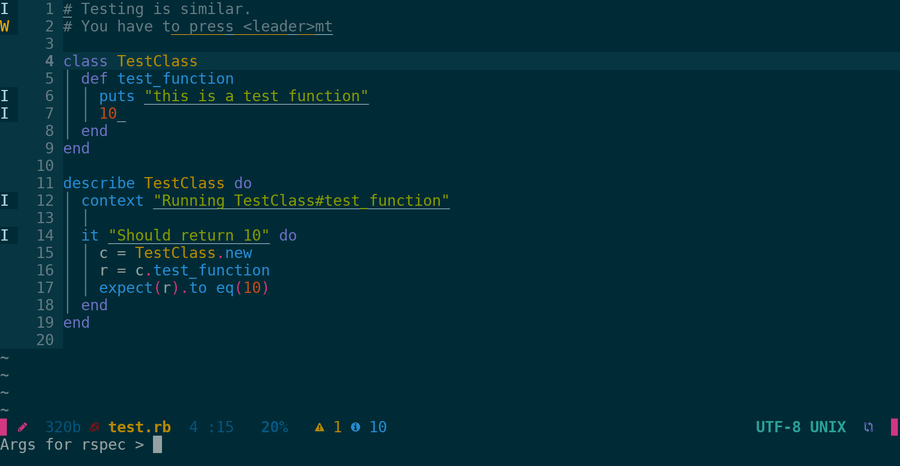
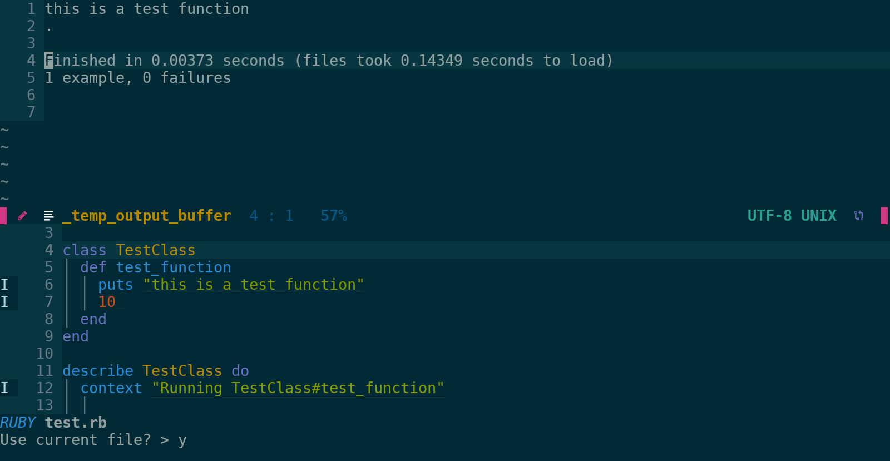

---

### REPL
#### Filetype REPL and Terminal REPL
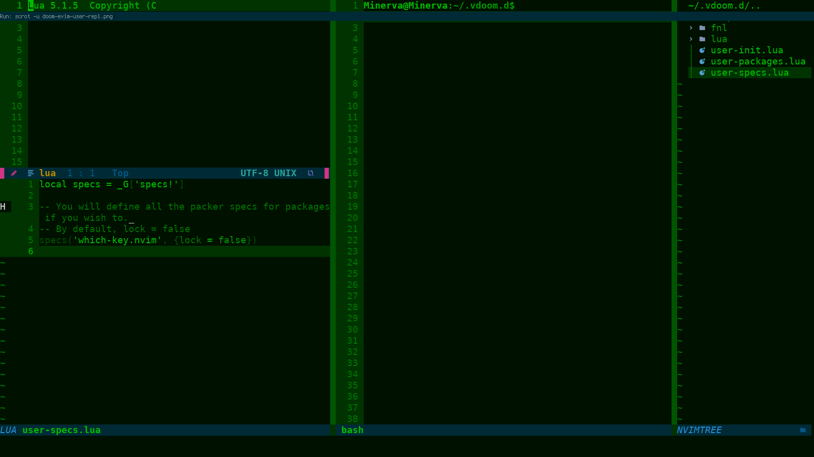

---

### Configuring packages post-initialization
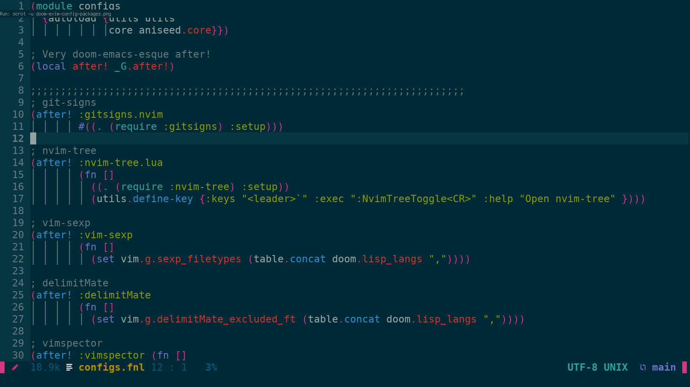

---

### Configuring packages pre-initialization

---

### Setup keybindings
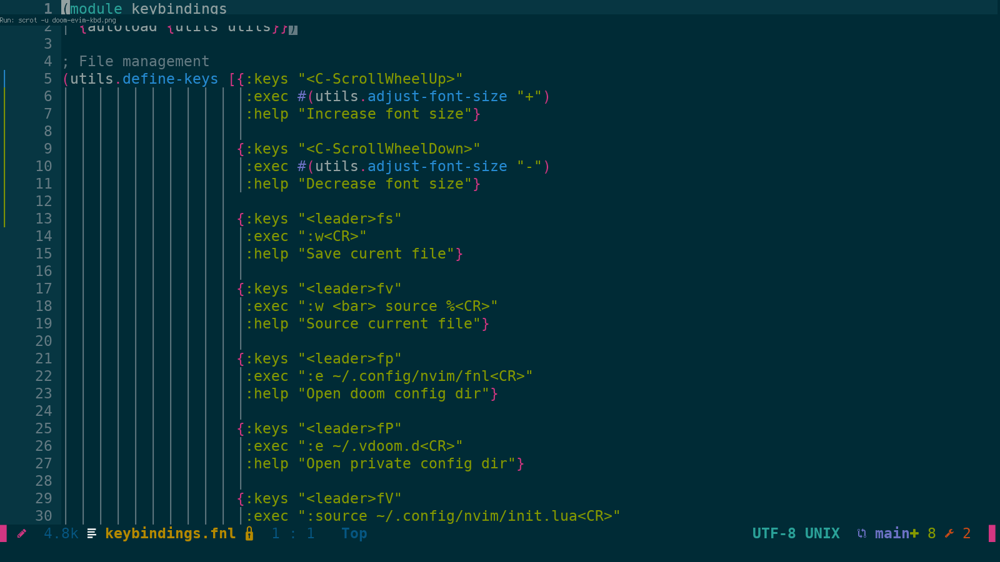

---
